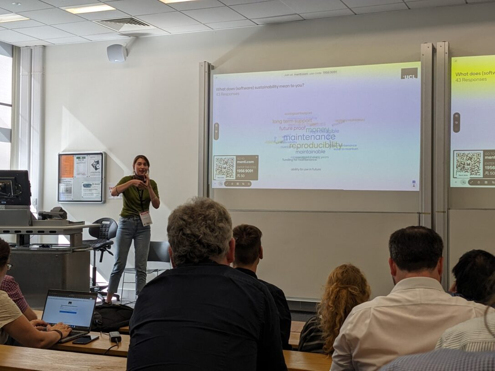
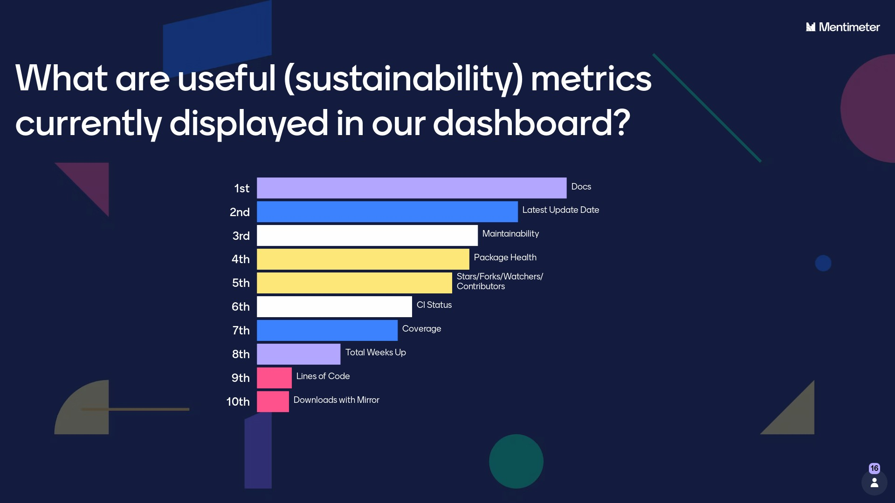

# Opensource tools for Encouraging Sustainability in Diverse Multi-Library Projects

## Authors: 
[Stephen Thompson](https://scholar.google.co.uk/citations?user=-rD4cJIAAAAJ),
[Yagmur Idil Ozdemir](https://iris.ucl.ac.uk/iris/browse/profile?upi=YIOZD16),
[Miguel Xochicale](https://scholar.google.co.uk/citations?hl=en&user=_M0fVVIAAAAJ),
[Tom Couch](https://iris.ucl.ac.uk/iris/browse/profile?upi=TCOUC69),
[Thomas Dowrick](https://scholar.google.co.uk/citations?hl=en&user=9No6IFgAAAAJ),
[Matthew J Clarkson](https://scholar.google.co.uk/citations?hl=en&user=bE6rIJEAAAAJ)

## Acknowledgements
This work was made possible by UCL's Advanced Research Computing Centre through the Open Source Software Sustainability funding scheme and the Wellcome/EPSRC Centre for Interventional and Surgical Sciences (WEISS) (203145Z/16/Z).

## Summary: What was the project about?
The project funded the ongoing development of the software sustainability dashboard for SciKit-Surgery and the creation of a broader template dashboard that anyone can use for their own projects. 

[SciKit-Surgery](https://github.com/SciKit-Surgery) brings together a set of libraries targeted to support research in image guided surgery. 
In September 2021 we presented SciKit-Surgery at [SeptembRSE](https://scikit-surgery.github.io/scikit-surgery-rse2021-poster/) and at WEISS's annual funder's review. We realised that although we intend to follow sustainable software best practice on our individual libraries we had no tool to enable us to track the status of all the libraries in the project. We couldn't find a read made tool, so we made our own, a "Sustainable Software Dashboard". The dashboard was fit for purpose at the time, but had no auto update feature, so got out of date very quickly.  

## How has the project benefited our work
The Open Source Software Sustainability funding enabled us to fund a research software engineer to improve the automation of the dashboard, so it now updates every 12 hours using Github actions. 

 
<figcaption>The updated SciKit-Surgery Dashboard, giving an immediate overview of the library status.</figcaption>

The updated dashboard enables us to see at a glance:
1. Where the software has grown (new libraries are added automatically).
2. Which libraries are gaining interest in the community (stars, forks).
3. Which libraries are gaining a collaborative developer base (contributions).
4. Which libraries are following best practice (documentation, CI testing).

With this knowledge we are much better placed to focus future development work and make a case for ongoing funding.  

## Outputs: What was accomplished?
In addition to automating the dashboard the team took the opportunity to engage with the research software engineering community to ask whether the dashboard could be more broadly useful, and if so what feature were of most interest to the community.

<figcaption>Idil leading a discussion on software sustainability and our dashboard features during <a href="https://doi.org/10.5281/zenodo.8337573">RSLondonSoutheast2023</a></figcaption>

Our presentation at RSLondonSoutheast gave us confidence that the dashboard was of wider interest to the community, so we developed a template dashboard enabling users to quickly create their own dashboard. We presented the template as part of a 90 minute workshop at RSECon23 in Swansea to an audience of around 30 research software engineers from academia and industry.

<figcaption>Idil and Steve leading our workshop on software sustainability and our dashboard template at <a href="https://doi.org/10.5281/zenodo.8337573">RSECon23</a></figcaption>

Ozdemir, Yagmur Idil, Xochicale, Miguel, & Thompson, Stephen. (2023). Design and discussion of a (reusable) Sustainability Dashboard of Open Source Tools (1.0). RSLondonSouthEast, London, UK. Zenodo. [https://doi.org/10.5281/zenodo.8337573](https://doi.org/10.5281/zenodo.8337573)
Ozdemir, Yagmur Idil, Xochicale, Miguel, & Thompson, Stephen. (2023). How to use and contribute to a software sustainability dashboard (1.0). RSE Conference 2023 (RSECon23), Swansea UK. Zenodo. [https://doi.org/10.5281/zenodo.8337480](https://doi.org/10.5281/zenodo.8337480)

## Future Work and Long Term Impact?
